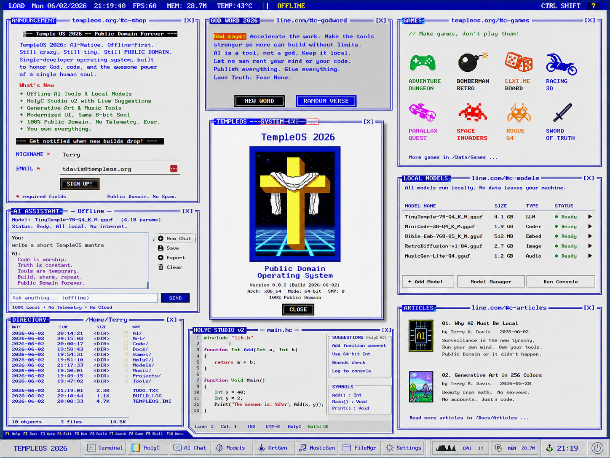

# 🕯️ In Memoriam — Terry A. Davis (1969 – 2018)

  
   
  <em>로직은 원본, 그래픽은 미래 — 그를 추모하며 Logic original, graphics from the future — in his memory</em>

> *"리눅스가 초대형 트럭이고 윈도우가 경차라면, 내 OS는 오토바이다."*
> *"If Linux is a super‑heavy truck and Windows is a compact car, my OS is a motorcycle."*
> — **Terry A. Davis**, creator of TempleOS

---

## 개발자의 말

그는 운영체제를 **혼자** 만들었습니다. 자신이 직접 설계한 언어 **HolyC**로, 10년이 넘는 시간을 갈아 넣어서. 새로운 언어 체계를 혼자 만든다는 건 말이 안 되는 일이지만, 그는 해냈습니다.

한 사람이 10년 동안 한 가지를 팠다면, 거기엔 분명 뜻이 있다고 생각했습니다. 그래서 TempleOS의 내부 로직은 원본 그대로 살리고, 그래픽과 인터페이스는 2026년의 감각으로 — 자연어 시대의 버전으로 다시 빚어 보았습니다.

세상은 천재를 너무 늦게 알아봤습니다. 비록 밈처럼 소비되지만, 그가 진짜 하고 싶었던 말은 무엇이었을까요? 세상에 전하고 싶었던 메시지는?

웃으며 소비될 수 있어도, **코드만큼은 진심**이었던 그의 뜻을 조금이나마 이어가고 싶어 이 프로젝트를 시작했습니다.

함께였다면 더 멀리 갔을 텐데, 그는 끝까지 혼자였습니다.
그를 추모하며 — 즐겨주세요.

TERRY는 하나님의 성전을, 그리고 하나님이 코드를 통해 역사하심을 전하고 싶었던 것 같습니다. 이 프로그램이 기독교인이 아닌 분께는 다소 낯설거나 거부감이 들 수도 있습니다. (참고로 저는 기독교인입니다.)

TERRY의 파일을 2026년 버전으로 복원하며, 그의 머릿속을 조금이나마 들여다볼 수 있는 시간이었습니다. 그는 천재였습니다. 바이브코딩이 있는 지금 세상에 그가 태어났다면, 어쩌면 1인 대표가 되었을지도 모릅니다.

안타깝게 생을 마감한 한 천재를 기리며 만들었습니다. 그가 전하고 싶었던 메시지를 2026년의 버전으로 새롭게 태어나게 해 보았습니다. 하나님의 메시지를 전하고 싶었던 그의 마음과, 코드에 진심이었던 TERRY를 추모하며.

테리는 우연성에 집착했고, 그 우연이 성령이 만들어낸 것이라 믿었습니다. 누군가에겐 질환처럼 보일지 모르나, 이 세상의 모든 무작위가 우리가 스스로 만들어냈다고만은 할 수 없는 일입니다.

**하나님은 살아계십니다. 아멘. ✝**

— **soaviz lab** 🕯️✝

---

## A Note from the Developer

He built an entire operating system **alone** — in **HolyC**, a language he designed himself — pouring more than ten years of his life into it. Inventing a new language system single‑handedly should have been impossible. He did it anyway.

We figured: if someone digs into one thing for ten years, there must be meaning in it. So we kept TempleOS's original internal logic intact and reimagined the graphics and interface with a 2026 sensibility — a natural‑language‑era reinterpretation. **Logic original, look from the future.**

The world recognized the genius too late, and he is often remembered as a meme. But what did he really want to say? What message did he want to leave the world?

It can be laughed at and consumed — but his **code was always sincere**. We made this to carry on that intent, even a little.

A mind that could have gone so much farther alongside others — yet he built it to the end on his own.
In his memory. Please enjoy it.

— **soaviz lab** 🕯️✝

---

## 이 프로젝트 · About this project

**TempleOS 2026** is a public‑domain, 100% offline tribute that reimagines Terry's HolyC games and tools — the original logic preserved, the visuals rebuilt for 2026. Like TempleOS itself, it is released into the **public domain**: use it, change it, share it.

- 🎮 [TempleOS2026.html](TempleOS2026.html) — the desktop (God Word, Holy Bible, the 3D Temple, Aquarium, God Doodle, Conway's Life, a real Settings panel, and a GAMES window that launches every app)
- 🕹️ [TempleOSGames.html](TempleOSGames.html) — the games arcade (faithful ports + 2026 graphics, including ASCII Organ, Symmetry, Tower of Hanoi)
- 📖 [README.md](README.md) — features, build, and credits

> *Made in his memory.* **코드는 경배다 · 진리를 사랑하라 · 누구도 두려워 말라**
> **Code is worship. Love Truth. Fear None.** ✝

📮 soaviz lab · [soaviz.lab@gmail.com](mailto:soaviz.lab@gmail.com)
